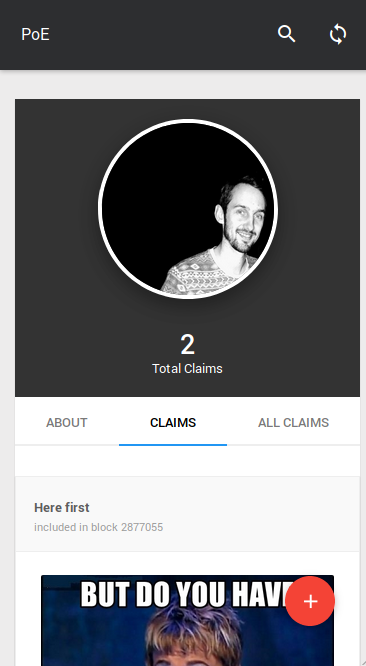

[Back](../README.md)

# Design Decisions
It was decided to keep the contract as simple as possible and offload the "heavy lifting" as far as possible to other system and just the blockchain where it will really add value. I'm of the opinion that a smart-contract is only a small part of a successful DApp, how the different components come together is what truly makes a good and successful blockchain application.

It was decided to not refer to uploaded content as "proofs", but instead as "claims". As a claim gets endorsed (upvoted) it could be seen as a trustable claim and only then it could serve as a proof. The opposite is also true, if a claim gets majority down votes, it could be seem as a false claim.

## Contract

### Contract Size
The contract was kept as simple a possible, without sacrificing functionality. As little as possible is stored on the blockchain and the contract has very little logic. This minimizes the number of possible bugs and code paths that needs to be tested. 

Unfortunately this makes it very hard to demonstrate "contract upgrading" without artificially adding functionality that does not add value to the project.

### Testing  
    

Test coverage is very good and the repository was hooked up with TravisCI to run 
the tests everytime the code sis committed. This has the benefit that the code gets tested in a clean environment very often.

An additional benefit of having good test coverage is that any developer who wants to pickup the codebase has examples of how to interact with the contract and how the contract is expected to function.

### E-stop
An emergency stop and contract ownership was implemented, purely to demonstrate that I know how to do it. This type of application does not need an owner and should not have a gatekeeper either. The lack of "business" logic that could potentially need upgrading also disqualifies this contract to have a real need for an owner / estop.

The stop was implemented to prevent new users from uploading new content (registering, updating bio and creating claims).

## Off-chain storage
It is well known that storage on the blockchain is expensive and gas limitation would make it impossible to store large claims on the blockchain. For this reason ipfs was chosen as the storage mechanism for the claims and bios. The hash of the data, which is also the address of the data, is then committed to the blockchain.

The format of the data in ipfs is not important from a smart-contract point of view, but for the UI to render the data correctly it is important that the data follows a certain structure.

## UI/UX
A common comment made about blockchain is that the UX is not great. For this reason I gave the UI and UX a lot of attention. The theme I used was designed to be responsive to be usable on different screen sizes. The app was tested on a PC and using the coinbase wallet (previously Toshi). Below are a comparison between the same view, first a PC and second on a mobile.

PC | Mobile 
--- | --- 
 |  

